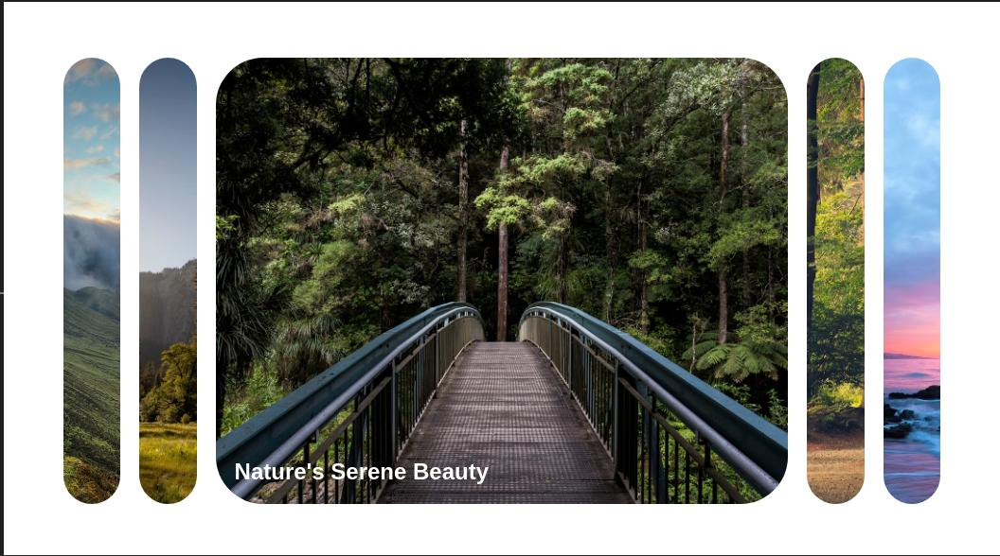

# Personal Project - Expanding Card

This is an Expanding Cards projects.

## Table of contents

- [Overview](#overview)
  - [The challenge](#the-challenge)
  - [Screenshot](#screenshot)
  - [Links](#links)
- [My process](#my-process)
  - [Built with](#built-with)
  - [What I learned](#what-i-learned)
  - [Continued development](#continued-development)
  - [Useful resources](#useful-resources)
- [Author](#author)
- [Acknowledgments](#acknowledgments)

## Overview

### The challenge

Users should be able to:

- See the card expand on click of the card

### Screenshot



### Links

- Solution URL: [https://github.com/ababaug/expanding_cards]
- Live Site URL: [https://ababaug.github.io/expanding_cards/]

## My process

### Built with

- Semantic HTML5 markup
- CSS custom properties
- Flexbox
- Mobile-first workflow
- JavaScript

**Note: These are just examples. Delete this note and replace the list above with your own choices**

### What I learned

Use this section to recap over some of your major learnings while working through this project. Writing these out and providing code samples of areas you want to highlight is a great way to reinforce your own knowledge.

To see how you can add code snippets, see below:

```html
<body>
  <div class="container">
    <div
      class="panel active"
      style="background-image: url('https://images.unsplash.com/photo-1470071459604-3b5ec3a7fe05?q=80&w=1574&auto=format&fit=crop&ixlib=rb-4.0.3&ixid=M3wxMjA3fDB8MHxwaG90by1wYWdlfHx8fGVufDB8fHx8fA%3D%3D');"
    >
      <h3>Explore The World</h3>
    </div>
    <div
      class="panel"
      style="background-image: url('https://images.unsplash.com/photo-1426604966848-d7adac402bff?q=80&w=1470&auto=format&fit=crop&ixlib=rb-4.0.3&ixid=M3wxMjA3fDB8MHxwaG90by1wYWdlfHx8fGVufDB8fHx8fA%3D%3D')"
    >
      <h3>Historical Wonders Await</h3>
    </div>
    <div
      class="panel"
      style="background-image: url('https://images.unsplash.com/photo-1447752875215-b2761acb3c5d?q=80&w=1470&auto=format&fit=crop&ixlib=rb-4.0.3&ixid=M3wxMjA3fDB8MHxwaG90by1wYWdlfHx8fGVufDB8fHx8fA%3D%3D')"
    >
      <h3>Nature's Serene Beauty</h3>
    </div>
    <div
      class="panel"
      style="background-image: url('https://images.unsplash.com/photo-1441974231531-c6227db76b6e?q=80&w=1471&auto=format&fit=crop&ixlib=rb-4.0.3&ixid=M3wxMjA3fDB8MHxwaG90by1wYWdlfHx8fGVufDB8fHx8fA%3D%3D')"
    >
      <h3>Wellness Oasis Found</h3>
    </div>
    <div
      class="panel"
      style="background-image: url('https://images.unsplash.com/photo-1475924156734-496f6cac6ec1?q=80&w=1470&auto=format&fit=crop&ixlib=rb-4.0.3&ixid=M3wxMjA3fDB8MHxwaG90by1wYWdlfHx8fGVufDB8fHx8fA%3D%3D')"
    >
      <h3>Oceanic Bliss Unleashed</h3>
    </div>
  </div>

  <script src="script.js"></script>
</body>
```

```css
@import url("https://fonts.googleapis.com/css2?family=Mulish:ital,wght@0,200..1000;1,200..1000&display=swap");

* {
  box-sizing: border-box;
}

body {
  font-family: "Mulish", sans-serif;
  display: flex;
  align-items: center;
  justify-content: center;
  height: 100vh;
  margin: 0;
  overflow: hidden;
}

.container {
  display: flex;
  width: 90vw;
}

.panel {
  background-size: auto 100%;
  background-position: center;
  background-repeat: no-repeat;
  height: 80vh;
  border-radius: 50px;
  color: #fff;
  cursor: pointer;
  flex: 0.5;
  margin: 10px;
  position: relative;
  transition: flex 0.7s ease-in;
}

.panel h3 {
  font-size: 24px;
  position: absolute;
  bottom: 20px;
  left: 20px;
  margin: 0;
  opacity: 0;
}

.panel.active {
  flex: 5;
}

.panel.active h3 {
  opacity: 1;
  transition: opacity 0.7s ease-in 0.4s;
}

@media (max-width: 400px) {
  .container {
    width: 100%;
  }

  .panel:nth-of-type(4),
  .panel:nth-of-type(5) {
    display: none;
  }
}
```

```JS
const panels = document.querySelectorAll('.panel');

panels.forEach((panel)=>{
    panel.addEventListener('click',()=>{
        removeActiveClass();
        panel.classList.add('active');
    })
})

function removeActiveClass(){
    panels.forEach((panel)=>{
        panel.classList.remove('active');
    })
}
```

## Author

- Website - [https://www.linkedin.com/in/augustine-stephen-abah-51103090/]
- Frontend Mentor - [@ababaug](https://www.frontendmentor.io/profile/ababaug)
